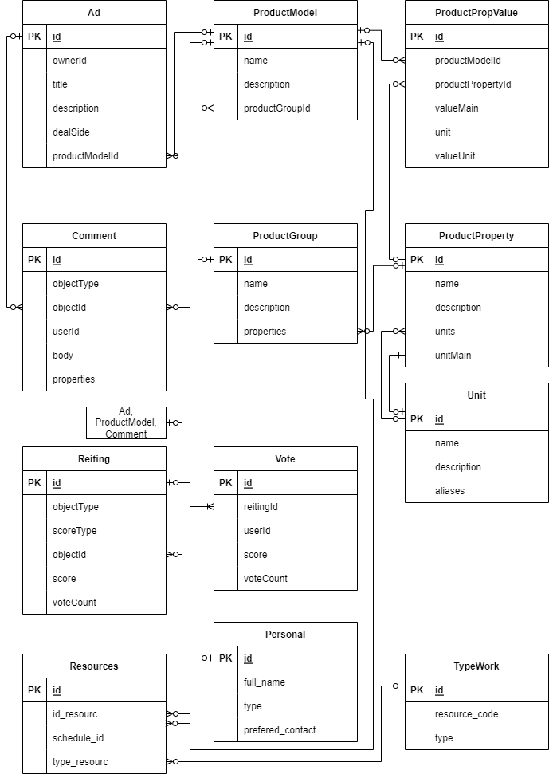

# CrowdProj project

This is an experimental project to create an Open Source social network aka Marketplace in a highly modular style.

## Roadmap

| Group / Subsystem | Microservice                                                                   | Purpose                                                                                                                                                                                  | Contributors                                     | Completeness | 
|-------------------|--------------------------------------------------------------------------------|------------------------------------------------------------------------------------------------------------------------------------------------------------------------------------------|--------------------------------------------------|--------------|
| Ads               | [Ads](https://github.com/crowdproj/crowdproj-ad)                               | User ads control. Users dispose texd descriptions of their demands or supplies to be met one another                                                                                     | [@svok](https://github.com/svok)                 | 20%          |
| Product           |                                                                                |                                                                                                                                                                                          |                                                  |              |
|                   | [Product Group](https://github.com/crowdproj/crowdproj-product-groups)         | Microservice for description of a products group. For instance, group "Refrigerators" has specific properties like color, weight, minimum temperature, etc.                              | [@phaeton03](https://github.com/phaeton03)       | 75%          |
|                   | [Product Model](https://github.com/crowdproj/crowdproj-product-models)         | Microservice for description of a product model. For instance, model "Refrigerator M-123" has specific values of the properties like weight is 30 kg, minimum temperature is -20 C, etc. |                                                  |              |
|                   | [Product Property](https://github.com/crowdproj/crowdproj-product-properties)  | Microservice for managing product properties. Properties have name, description, units of measure, etc.                                                                                  | [@Riafka](https://github.com/Riafka)             | 70%          |
|                   | [Product Property Value]()                                                     |                                                                                                                                                                                          |                                                  |              |
| References        | [Units](https://github.com/crowdproj/crowdproj-units)                          |                                                                                                                                                                                          | [@fooglish](https://github.com/fooglish)         | 70%          |
| Comments          | [Comment](https://github.com/crowdproj/crowdproj-comments)                     | A microservice for managing comments feature for any object (article, product, news, etc.)                                                                                               | [@StellaLupus](https://github.com/StellaLupus)   |              |
| Ratings           | [Ratings](https://github.com/crowdproj/crowdproj-ratings)                      |                                                                                                                                                                                          | [@shvetson](https://github.com/shvetson)         | 75%          |
|                   | [Vote](https://github.com/crowdproj/crowdproj-ratings-votes)                   |                                                                                                                                                                                          |                                                  |              |
| Resource planner  |                                                                                | Calendar allows to plan access to some limited resources like computers, labour, time, etc.                                                                                              |                                                  |              |
|                   | [Resources](https://github.com/crowdproj/crowdproj-resources)                  | Reference for the available resources                                                                                                                                                    | [@Zuzichev](https://github.com/Zuzichev)         |              |
|                   | [Resource Schedule Template](https://github.com/crowdproj/crowdproj-resources-schedule-template)                                                 | Timeslots distribution over time, including specification of the working days, holidays and weekends                                                                                     | [@elakovnick24](https://github.com/elakovnick24) |              |
|                   | [Resource Bookings](https://github.com/crowdproj/crowdproj-resources-bookings) | Available and booked timeslots must be controlled by this entity                                                                                                                         | [@kulabuha](https://github.com/kulabuha)         |              |
|                   | [Events]()                                                                     | Event specifies the detail about the booking for the resources and lists the timeslots for the resources                                                                                 |                                                  |              |
| Library           |                                                                                | Library is a subsystem for management of different resources: video, music, documents, custom files, etc.                                                                                |                                                  |              |
|                   | [Documents](https://github.com/crowdproj/crowdproj-library-documents)          | Reference of stored documents                                                                                                                                                            |                                                  |              |
|                   | [Stored Resources](https://github.com/crowdproj/crowdproj-library-resources)   | Resources attached to the document                                                                                                                                                       |                                                  |              |
|                   | [Statuses of resources](https://github.com/crowdproj/crowdproj-library-statuses)| Status model (registry of statuses) for resources (files) and documents                                                                                                                  |
|                   | [Catalog of storages]()                                                        | Registry of available physical storages where the resources can be stored                                                                                                                |
| Tags              | [Tags](https://github.com/crowdproj/crowdproj-tags)                            | Tags management and provisioning to other services                                                                                                                                       |                                                  |              |

## Structure

### Component diagram

### Entities

## Contacts

Telegram groups for discussions:

Development questions: [crowdproj-dev](https://t.me/crowdproj_dev)

Startup questions: [crowdproj-com](https://t.me/crowdproj_com)
