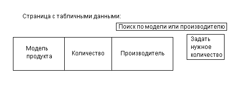

# Тренды поведения 2023

В 2023 году российские покупатели стали более бережливыми, выбирая стратегии разумного потребления.

Ситуация в стране и, в целом в мире, во многом определяют поведение: если можно что-то использовать бесплатно - это будет использоваться.

Крупные маркетплейсы вынуждены стараться набрать как можно большую покупательную аудиторию, и частично отбить расходы на рекламе.

(с) rbc.ru
## Фронтенд
