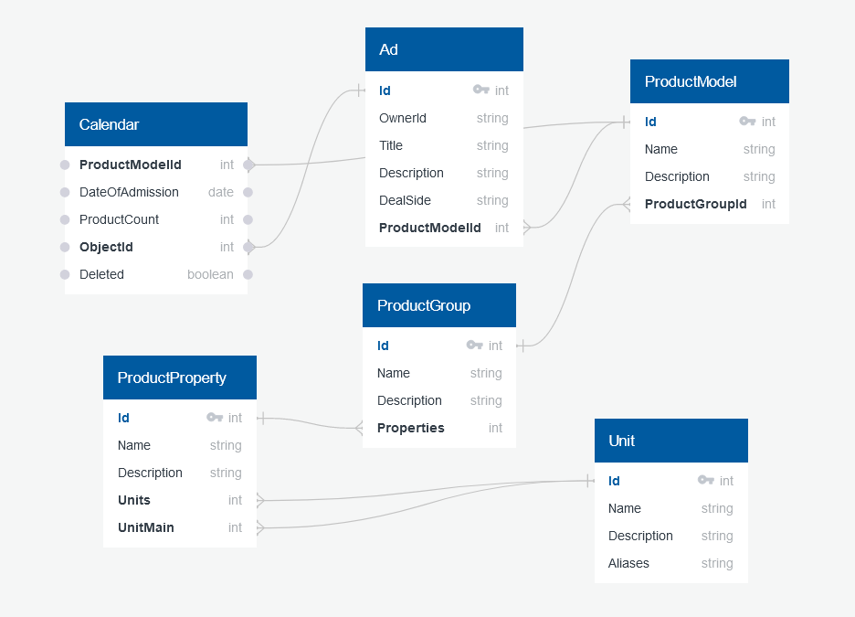

# API

## ER-диаграмма связанных сущностей

## Описание сущности Calendar

   1. id: Int PK
   2. productModelId: Int - ссылка на объект в таблице ProductModel
   3. dateOfAdmission: DateTime - дата поступления
   4. productCount: Int - доступное количество
   5. objectId: Int - ссылка на объект в таблице Ad
   6. deleted: Boolean - признак удаленного товара. 

## Функции (эндпониты)

1. CRUDS (create, read, update, delete, search) для Calendar
   1. create
   2. read по id
   3. update по id
   4. delete, установка флага deleted.
   5. search, поиск