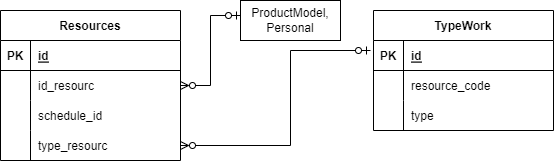

# API

## ER-диаграмма связанных сущностей

//TODO исправить картинку!

 

## Описание сущности Resources 
   1. id,
   2. ResourceId - ссылка на конкретный ресурс (например, в таблице Personal/ProductModel),
   3. ScheduleId - ссылка в микросервис Resource Schedule Template на выбранный график использования ресурса,
   4. TypeId - тип ресурса, ссылка на таблицу TypeWork.
   
## Функции (эндпониты)

1. CRUD (create, read, update, delete) для Resources
   1. create
   2. read по id
   3. update по id
   4. delete, установка флага deleted.
